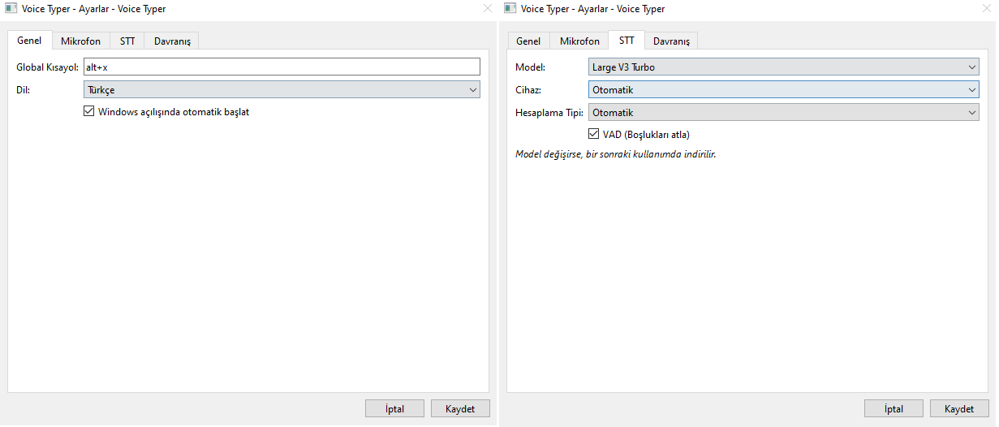
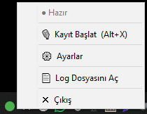

# Voice Typer

Voice Typer is a local-first Windows speech-to-text desktop application that records speech through a global hotkey, transcribes it locally using faster-whisper, and inserts the resulting text into the application that was active when recording started. 

Voice Typer performs all transcription entirely locally. No cloud speech API is used, ensuring complete privacy.

---

## 1. Overview
Voice Typer sits in your system tray and listens for a customizable global hotkey. When triggered, it records your voice, passes the audio through a highly optimized local STT engine (`faster-whisper` running on CTranslate2), and seamlessly types the resulting text directly into your active window via native Win32 `SendInput` APIs. 

## 2. Features
- **Native Win32 Global Hotkey:** Control recording from any application without losing focus.
- **100% Local Transcription:** Uses `faster-whisper` for fast and private offline speech-to-text.
- **NVIDIA CUDA Acceleration:** Bundled with CUDA/cuDNN runtime for native GPU acceleration (CPU fallback available).
- **Active Window Protection:** Memorizes the foreground `HWND` during recording to prevent accidental text injection if focus changes.
- **Clipboard Restoration:** Safely preserves and restores your clipboard content during the automated `Ctrl+V` text injection process.
- **Lazy Model Loading:** Hugging Face models are cached locally and loaded into RAM only when needed.
- **Configurable Inference:** Selectable model sizes (`large-v3-turbo`, `small`, etc.), device (`auto`, `cuda`, `cpu`), and compute types (`float16`, `int8`).
- **Silero VAD Integration:** Filters out silence and background noise before transcription.
- **System Tray Integration:** Lightweight PySide6 GUI for managing settings and application lifecycle.
- **Single-Instance Protection:** Cross-process named Mutex prevents multiple instances from running simultaneously.
- **Safe Cooperative Shutdown:** Gracefully handles active audio streams and transcription threads during exit.
- **Data Privacy Separation:** Application binaries and user data (`%LOCALAPPDATA%\VoiceTyper`) are strictly separated.
- **Per-User Installer:** Packaged with PyInstaller (onedir) and distributed via a low-privilege Inno Setup installer.

## 3. Screenshots

### Settings
Configuration for the global hotkey, language, model, device, compute type, and VAD.



### System Tray
Quick access to recording, settings, logs, and application exit.



## 4. How It Works
1. User presses the global hotkey (e.g., `Alt+X`).
2. The application registers the currently active window handle (`HWND`) and begins recording audio via WASAPI.
3. User presses the hotkey again to stop recording.
4. Audio is normalized to 16 kHz (with native fallback interpolation if rejected by the driver) and passed to the local `faster-whisper` engine.
5. The transcribed text is placed on the clipboard.
6. A synthetic `Ctrl+V` keypress is sent to the target `HWND`.
7. The original clipboard contents are seamlessly restored.

## 5. Architecture
Voice Typer relies on an asynchronous event-driven architecture to prevent GUI lockups during heavy transcription tasks.

```
Global Hotkey 
     ↓
AudioRecorder (WASAPI)
     ↓
WAV / 16 kHz normalization
     ↓
AppController (State Machine)
     ↓
FasterWhisperProvider (Worker Thread)
     ↓
CUDA or CPU (CTranslate2)
     ↓
Transcript
     ↓
ClipboardManager & TextInjector (Win32)
     ↓
Target Application
```

### Application State Machine
To ensure reliable operation, the application enforces strict state transitions:
`IDLE` → `RECORDING` → `PROCESSING` → `LOADING_MODEL` → `PROCESSING` → `IDLE`

Operation IDs and stale callback protection are implemented to prevent race conditions (e.g., stopping a transcription midway and starting a new recording before the previous thread exits).

## 6. Tech Stack
- **Python 3.14**
- **PySide6** (System Tray GUI & Threading)
- **faster-whisper & CTranslate2** (Speech-to-Text inference)
- **sounddevice & soundfile** (Audio capture)
- **pywin32** (Win32 API integration)
- **PyInstaller** (Frozen executable packaging)
- **Inno Setup** (Windows Installer)

## 7. Installation
You can build the installer from source (see [Building the Installer](#15-building-the-installer)) or download the pre-compiled Setup executable from the Releases page.
The installer does **not** require Administrator privileges and installs to `%LOCALAPPDATA%\Programs\VoiceTyper`.

## 8. Usage
1. Launch Voice Typer from the Start Menu.
2. A microphone icon will appear in your system tray.
3. Click inside any text field (e.g., Notepad, Word, your web browser).
4. Press `Alt+X` (default hotkey) to start recording.
5. Speak your sentence.
6. Press `Alt+X` again. The text will instantly appear in your active window.

## 9. Configuration
Settings are stored in `%LOCALAPPDATA%\VoiceTyper\config.json`. You can manually adjust parameters such as the hotkey, microphone device index, sample rate, and model size. Malformed JSON will be automatically backed up and safely replaced with defaults.

## 10. CPU / NVIDIA CUDA Support
Voice Typer automatically detects NVIDIA GPUs and uses `float16` CUDA inference for maximum speed. If no compatible GPU is found, or if initialization fails, it gracefully falls back to `int8` CPU inference. 
The CUDA/cuDNN DLLs are dynamically injected into the process space during runtime via `os.add_dll_directory`, ensuring the host system's `PATH` variable is not polluted.

## 11. Privacy
- **100% Local Inference:** Speech transcription is performed locally.
- **No Cloud API:** Audio is never sent to a cloud transcription provider.
- **Model Downloads:** Model binaries are downloaded directly from the Hugging Face Hub (e.g., `mobiuslabsgmbh/faster-whisper-large-v3-turbo`) and cached locally.
- **No Audio Retention:** Audio recordings are processed and immediately deleted by default. They are not retained on disk.
- **No Telemetry:** Transcript contents are not written to application logs or sent to any server.
- **Sandboxed Data:** Runtime data lives securely under `%LOCALAPPDATA%\VoiceTyper`.

## 12. Project Structure
```text
VoiceTyper/
├── app/
│   ├── core/           # STT, Audio, Clipboard, State Machine
│   ├── services/       # Config, Logger, CUDA runtime, Registry
│   └── ui/             # PySide6 Tray Icon
├── tests/              # Regression and Architecture Tests
├── docs/               # Documentation
├── main.py             # Application Entrypoint
├── requirements.txt    # Production Dependencies
├── voice_typer.spec    # PyInstaller Build Spec
├── installer.iss       # Inno Setup Script
└── README.md
```

## 13. Development Setup
To set up the project for development on Windows:

```powershell
# Create a virtual environment
python -m venv .venv

# Activate the virtual environment
.\.venv\Scripts\activate

# Install dependencies
pip install -r requirements.txt

# Run the application
python main.py
```
*(Alternatively, you can use the provided `setup.bat` and `run.bat` scripts).*

## 14. Building with PyInstaller
To create a portable `.exe` bundle (onedir format) including the CUDA runtime:
```powershell
pyinstaller voice_typer.spec --noconfirm
```
The output will be generated in `dist\VoiceTyper`.

## 15. Building the Installer
To build the per-user installer:
1. Ensure the PyInstaller build is complete.
2. Open `installer.iss` in Inno Setup Compiler.
3. Click **Compile**.
The output `VoiceTyperSetup.exe` will be generated in the `installer\` directory.

## 16. Testing
Meaningful architectural and regression tests are located in the `tests/` directory. These include state transition checks, shutdown simulations, and config recovery validations.

## 17. Technical Challenges / Engineering Notes
Developing a seamless background voice-typing tool for Windows presented several engineering challenges:
- **Win32 Hotkey Integration:** Combining blocking `RegisterHotKey` Win32 calls with the asynchronous `PySide6` event loop via native event filtering (`installNativeEventFilter`).
- **CUDA Runtime Packaging:** Packaging the massive NVIDIA CUDA/cuDNN `.dll` files via PyInstaller without modifying the permanent system `PATH` or exposing the system to DLL hijacking.
- **Asynchronous State Management:** Preventing race conditions using Operation IDs when a user rapidly triggers hotkeys before a heavy CTranslate2 worker thread completes.
- **Active HWND Protection:** Storing the foreground window handle the moment recording starts and strictly validating it before pasting, ensuring text is never injected into the wrong window if the user switches apps.
- **Clipboard Preservation:** Implementing a best-effort backup and restore mechanism for `CF_UNICODETEXT`, `CF_DIB`, and other clipboard formats so the user doesn't lose their copied data during injection.
- **Shutdown Deadlocks:** Diagnosing and resolving a cooperative shutdown deadlock caused by a non-reentrant lock blocking the Qt Main Thread during STT worker termination.

## 18. Known Limitations
- **Windows Only:** Heavily relies on Win32 APIs for hotkeys, clipboard, and input injection.
- **First Launch Internet Requirement:** The application requires internet access during its first STT execution to download the specified model from Hugging Face.
- **Hardware Requirements:** Large models (like `large-v3-turbo`) consume substantial RAM/VRAM. CPU inference on older hardware may result in slight latency.
- **Sample Rate Fallback:** If a microphone strictly rejects 16 kHz WASAPI streams, the application falls back to linear interpolation downsampling (`numpy.interp`), which may introduce minor aliasing (though negligible for Whisper's acoustic characteristics).

## 19. Roadmap
- Expand GUI Settings to allow changing models and hotkeys visually.
- Memory usage optimization for long-running idle states.
- Broader microphone compatibility testing.
- Implement automated CI pipelines for tests and builds.

## 20. Security
Please review `SECURITY.md` for our vulnerability reporting guidelines. A comprehensive baseline security audit is available in `SECURITY_AUDIT.md`.

## 21. License
This project is licensed under the MIT License. See the `LICENSE` file for details.
